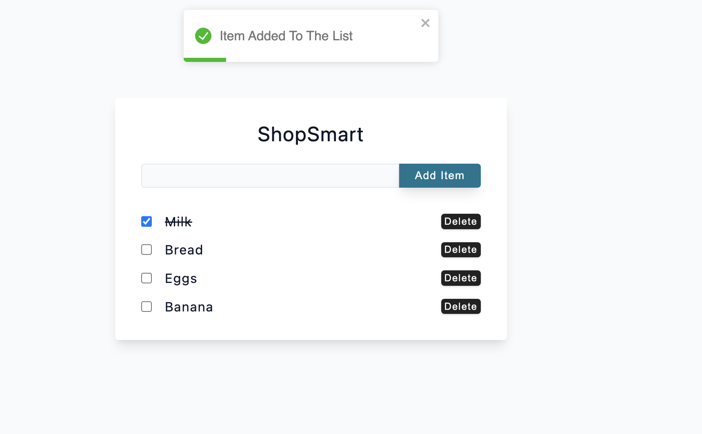

## ShopSmart

`ShopSmart` is a React-based app that helps users manage their grocery lists. With features like adding and removing items, marking completed items, and utilizing `local storage` for persistence, it provides a user-friendly experience. It utilizes the `react-toastify` library to provide `toast notifications` for alerts during list interactions. 

                  