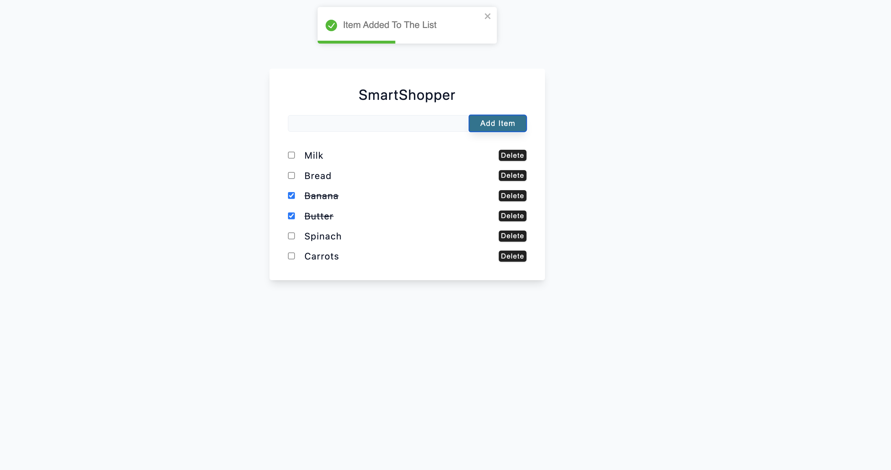

## SmartShopper

`SmartShopper` is a React-based app that helps users manage their grocery lists. With features like adding and removing items, marking completed items, and utilizing `local storage` for persistence, it provides a user-friendly experience. 

### Tech Stack
- `JavaScript`
- `React` JavaScript library used for building the project:
- - `useState` React hook used to manage state and create a state variable for the questions array.
- `nanoid`: A library used for generating unique IDs, enhancing data handling and management within the project.
- `react-toastify`: A library to provide `toast notifications` for alerts during list interactions.

### Explore The Website
[SmartShopper on Netlify](https://smart-shopper.netlify.app/)

### Preview

                  